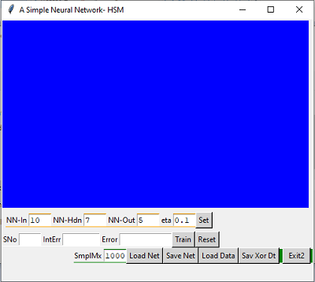
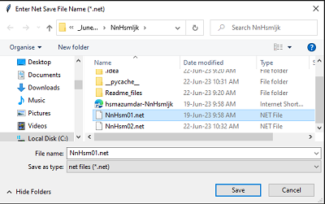
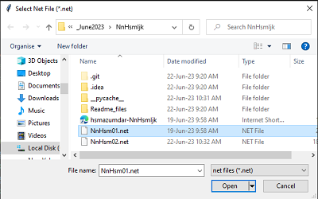

# NnHsmIjk
A Simple Neural Network with GUI

Figure-1 Artificial Neural Network with Input, Hidden and Output neurons.

A multi-layer neural networks shown in figure-1  with backpropagation (BP) are simple and basic form of artificial neural network architecture. It consists of an input layer, a hidden layer, and an output layer.
  

Figure-2 A two-layer Neural Network with forward pass and back propagation training equations.

In figure-2 the input layer (Yi) receives the input data, which could be numerical or categorical features, and passes them forward to the hidden layer (Xj). The hidden layer performs a linear combination of the input values using weights (Wij) and applies a non-linear activation function to produce an output (Yj). Common activation functions include sigmoid, tanh, and ReLU. The purpose of the activation function is to introduce non-linearity into the network, allowing it to learn complex patterns and relationships in the data

The output layer (Xk) receives the transformed data from the hidden layer through wights and performs another linear combination using weights (Wjk). The final output of the network is obtained by applying an activation function to the result of the output layer (Yk). The activation function used in the output layer depends on the nature of the problem being solved. For example, if it is a binary classification problem, a sigmoid function might be used, while a softmax function could be used for multi-class classification.

  

During the training process, the network adjusts the weights using the backpropagation algorithm. Backpropagation calculates the gradients of the loss function with respect to the weights of the network. It then updates the weights by taking small steps (eta) in the opposite direction of the gradients, using an optimization algorithm such as stochastic gradient descent (SGD).

The number of neurons in the hidden layer is a hyper parameter that needs to be determined based on the complexity of the problem and the amount of available data. Too few neurons may result in under fitting, while too many neurons can lead to overfitting. Finding an appropriate number of neurons often requires experimentation and tuning.

Figure-3
  

Overall, a two-layer neural network with backpropagation is a basic and widely used architecture for solving various machine learning problems. While it is relatively simple compared to more complex neural network architectures, it can still be effective for tasks with moderate complexity.

Quick Start Steps-

1. Download the zip file and unzip in a folder NnHsmIjk.

2. Select NnLip.py and NnXor.py files and load in VS Code

3. Install necessary library components

4. Run NnXor.py to popup NnHsmIjk application of figure-2

 

Figure-4
  

Figure-5

Figure-6
  

Figure-7
  

Figure-8
  

